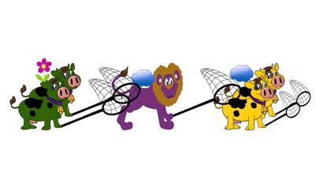
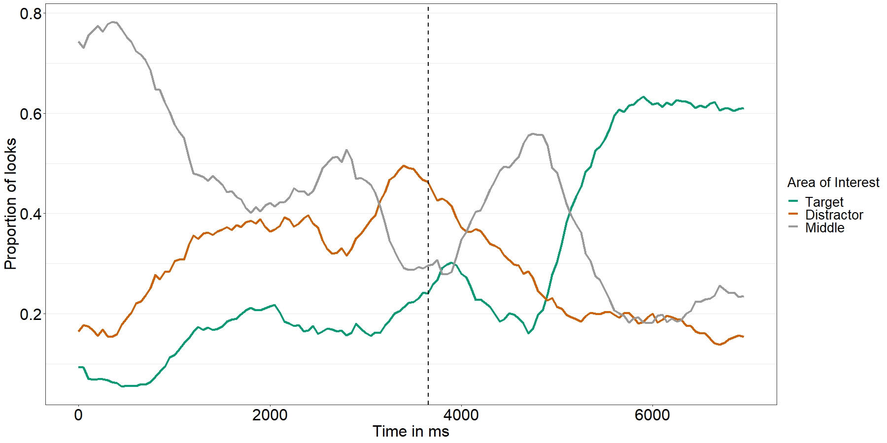

## Modeling eye movement data during spoken language comprehension

---

#### 📝 In short: This project is part of a research study in cognitive science, whereby participants' eye movements were tracked and recorded while they watched a visual scene on a computer and heard a question about it. The goal was to predict whether a participant will look at the Target region on the screen given different characteristics of the task and the visual and linguistic inputs. A Logistic Regression had a Precision score of 0.63 on both the training and testing data sets. An XGBoost Classifier yielded a Precision score of 0.77 on the training and testing data sets.

---

The data in this project come from a study that was published in my dissertation (Haendler, 2017; University of Potsdam; title: '_Effects of Embedded Pronouns on Relative Clause Processing: Cross-linguistic Evidence from Children and Adults_').

In the experiment, participants watched short animated cartoons and listened to questions about the colors of the figures in these videos (see example below). While watching and listening, eye movements to the three regions of interest (the animal(s) on the left side, the animal(s) on the right side, and the animal(s) in the middle) were recorded.

Corresponding to the example screenshot from one of the videos used in the experiment, participants first heard an introduction that was roughly: 

_There are two cows on the left, and there are two cows on the right._
_And there's also a lion._

Q1: _What color are the cows that the lion is catching?_

Or, another type of sentence, could be:

Q2: _What color are the cows that are catching him?_

For the first question (Q1), the **Target** region includes the cows on the right, and the correct answer to the question is "yellow". The **Distractor** region contains are the cows on the left, and the **Middle** region is the lion.

For the second question (Q2), the **Target** region are the cows on the left, and the correct answer is "green". The **Distractor** region are the cows on the right, and the **Middle** region is again the lion.

Eye movements were recorded using an SMI RED-m eye-tracker, with a sample rate of 120Hz (location of the eyes was recorded about every 8 ms) starting at the beginning of the the question ("_What color..._") and ending a couple of seconds after the question ended.

The experiment was carried out in Italian. Participants were 68 Italian speaking children, 4-6 years of age (the study was approved by the ethics committee of the University of Potsdam, and parents gave their signed consent to their children's participation).

Below is an example of how the looks to the 3 regions of the screen are plotted. The sentence corresponding to this example is "_What color are the cows that the lion is catching?_"

The vertical dashed line marks the word "_that_", after which the linguistic information for the sake of identifying the Target figure(s) started being processed. 

In this repository, I am presenting an analysis of the eye movement data that is an alternative to the one used in the dissertation. 

In the dissertation, the data were analyzed using Logistic Regression with polynomial features, and only the features relevant for the hypothesis testing were included in the model. The main goal of that analysis was to interpret the model coefficients, which were coded in a way that would allow to reject or accept the Null Hypothesis that stated that there is no difference in eye movements between different types of sentences.

In this notebook, I use Logistic Regression to predict Target looks and compare model performance to that of an XGBoost Classifier. 

Most of the data cleaning was done when reading the single output files from the SMI software package, including for instance the deletion of missing data (due to blinking, to abrupt head movements of the participants, to hardware issues that led to interruption of the recording and so on), and of data that was outisde of the regions of interest, meaning that only looks to either of the three regions are in the dataframe that we will work with.

---
